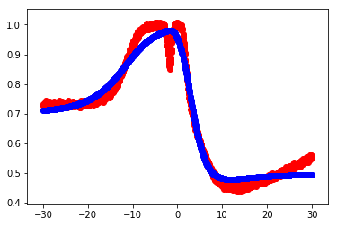

# yynn
A neural network framework in C++.

This framework comes from homework. By the time I finished the neural network using numpy as scipy in Python, I felt like implementing one neural network by myself. So there it is!.


This framework has features like:

- Slow

- Lame usage

- Bad runtime speed

But I am working on that! Give me a star and get updated!

---

# Usage

add all files in your workspace, and use the neural network by

```C++
#include 'nn.h'
```

You can create a neuralnetwork object by

```C++
vector<int> layer_info{1,2,1};
double learning_rate = 0.01
neuralnetwork::neuralnetwork nn(layer_info, learning_rate);
```

You can feed the data and train the model by
```C++
vector<vector<double> > X, Y; // Some data you get from elsewhere

nn.train(X, Y);
```

Then you can run the evaluation to get predictions

```C++
vector<vector<double> > x;

nn.evaluation(x);
```

Since it based on the homework, the evaluation part is only made for a regression function. You can rewrite the evaluation() to fit your own purpose. Here 's the result of the regression in lecture by using 100 unit of 1-hidden layer training for 200 epoch.




